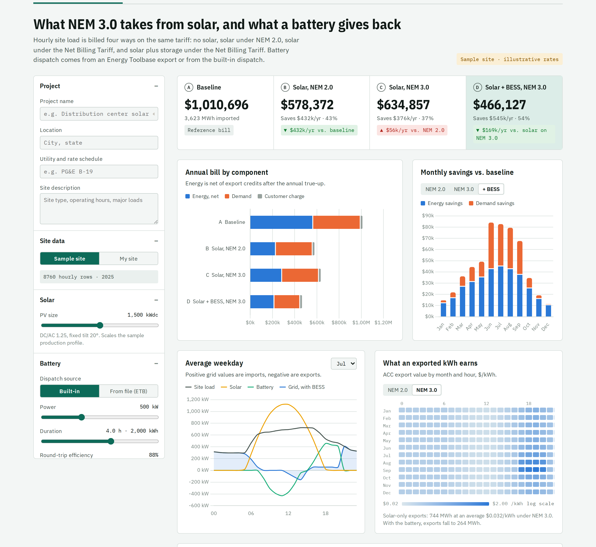
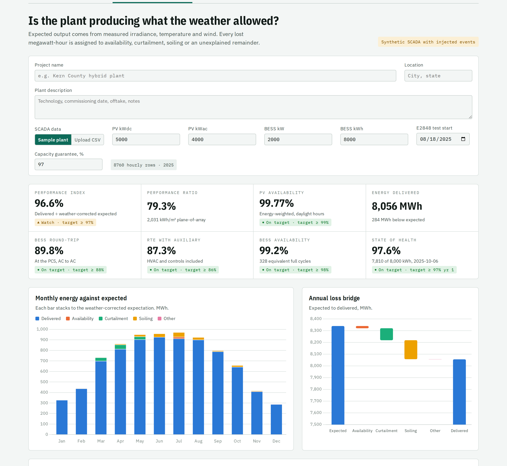

# Solar and Storage Analysis Tools

Two tools for solar and battery storage projects. The first estimates how a move from NEM 2.0 to NEM 3.0 changes a site's utility bill, and how much adding a battery saves. The second compares a PV and battery plant's actual output with what the weather allowed, and breaks down where energy was lost.

**Live site:** https://chirag121094.github.io/solar-storage-workbench/  
**Author:** Chirag Shetty · [LinkedIn](https://www.linkedin.com/in/cs753951/) · chiragshetty68@gmail.com



## 1. NEM 3.0 storage savings

California's Net Billing Tariff (NEM 3.0) credits exported solar at hourly Avoided Cost Calculator (ACC) values instead of the retail rate. Midday exports now earn a few cents per kWh. This tool shows how much of the solar business case that removes, and how much a battery wins back.

It bills the same site four ways on the same TOU tariff:

| Scenario | What changes |
|---|---|
| A. Baseline | No solar |
| B. Solar, NEM 2.0 | Exports earn the retail TOU rate minus non-bypassable charges |
| C. Solar, NEM 3.0 | Exports earn the hourly ACC value |
| D. Solar + BESS, NEM 3.0 | Battery stores midday surplus and serves the 4–9 pm peak |

**Inputs.** Each is a CSV with a timestamp column and a kWh column, 8760 hourly or 35040 15-minute rows:
1. Utility load interval data (required)
2. Solar production 8760 (optional; a modeled profile is used otherwise)
3. Energy Toolbase battery export (optional; one signed column, or separate discharge and charge columns)

Tariff rates, the 12 × 24 ACC export matrix and project costs are editable on the page.

**Sample result** (synthetic 3.6 GWh/yr warehouse, 1,500 kWdc PV, 500 kW / 2,000 kWh BESS, illustrative rates):

| | Annual bill | Savings |
|---|---|---|
| Baseline | $1,010,696 | — |
| Solar, NEM 2.0 | $578,372 | $432,324 |
| Solar, NEM 3.0 | $634,857 | $375,839 |
| Solar + BESS, NEM 3.0 | $466,127 | $544,569 |

The move to NEM 3.0 costs this site about $56k a year. The battery recovers $169k a year over solar alone, most of it from demand charges.

## 2. Hybrid asset performance



For a PV + BESS plant with hourly SCADA:
- Expected output from a PVWatts-style model (Sandia module temperature, −0.35 %/°C, DC losses, inverter efficiency, clipping)
- Performance ratio and weather-corrected performance index
- Loss attribution: availability, curtailment, soiling, other
- Daily soiling ratio with automatic detection of rain and wash events
- ASTM E2848 regression capacity test on any 14-day window
- Battery round-trip efficiency with and without auxiliary load, availability, cycles and state of health

## Get started

**Just want to see results?** Open the [live site](https://chirag121094.github.io/solar-storage-workbench/). Nothing to install. On Sheet 01, choose **My site** and upload your utility interval data, an optional solar 8760 and an optional Energy Toolbase battery export.

**Want to run the Python?**

1. Get the code: click the green **Code** button above → **Download ZIP**, then unzip it. Or, with Git installed:
   ```bash
   git clone https://github.com/Chirag121094/solar-storage-workbench.git
   cd solar-storage-workbench
   ```
2. Install Python 3.10 or newer from [python.org](https://www.python.org/downloads/), then install the two libraries:
   ```bash
   pip install -r requirements.txt
   ```
3. Run the engines from the `python` folder:
   ```bash
   cd python

   # NEM savings: one combined file, or separate load / solar / battery files
   python nem_bess_savings.py ../data/sample_site_8760.csv
   python nem_bess_savings.py --load utility.csv --solar solar_8760.csv --battery etb_export.csv

   # Asset performance
   python asset_performance.py ../data/hybrid_site_scada_8760.csv ../data/bess_daily.csv ../data/bess_capacity_tests.csv
   ```
   On Windows, use `py` in place of `python` if `python` is not found.

Expected output for the sample site:

```
scenario        Baseline (no solar)  Solar, NEM 2.0  Solar, NEM 3.0  Solar + BESS, NEM 3.0
annual_bill               1,010,696         578,372         634,857                466,127
energy_net                  567,232         231,035         287,520                217,860
demand                      427,263         331,137         331,137                232,067
export_mwh                        0             744             744                    264
total_savings                     0         432,323         375,838                544,569
```

The website runs the same calculations in the browser, and the two agree to the dollar. `python gen_data.py` regenerates the synthetic sample data.

## Repository layout

```
index.html        the website (single file, no build step)
data/             synthetic sample CSVs and the ACC matrix template
python/           nem_bess_savings.py, asset_performance.py, gen_data.py
docs/             screenshots
```

## Publish on GitHub Pages

1. Create a public repository named `solar-storage-workbench` and upload these files.
2. Settings → Pages → Source: **Deploy from a branch**, Branch: **main**, folder **/ (root)**.
3. The site appears at `https://chirag121094.github.io/solar-storage-workbench/` within a minute or two.
4. Optional: add a custom domain under Settings → Pages.

## Data and assumptions

All sites, SCADA data and rates are synthetic or illustrative. No client data is used. The tariff follows the structure of a PG&E B-19 secondary TOU schedule, and the ACC matrix follows the typical shape of published values. Neither uses current published numbers. Replace both with the current tariff sheet and the customer's ACC vintage before using results for a real project.
